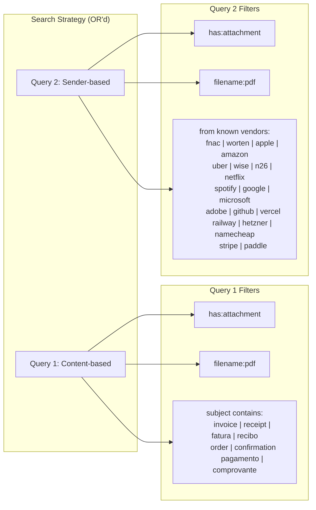
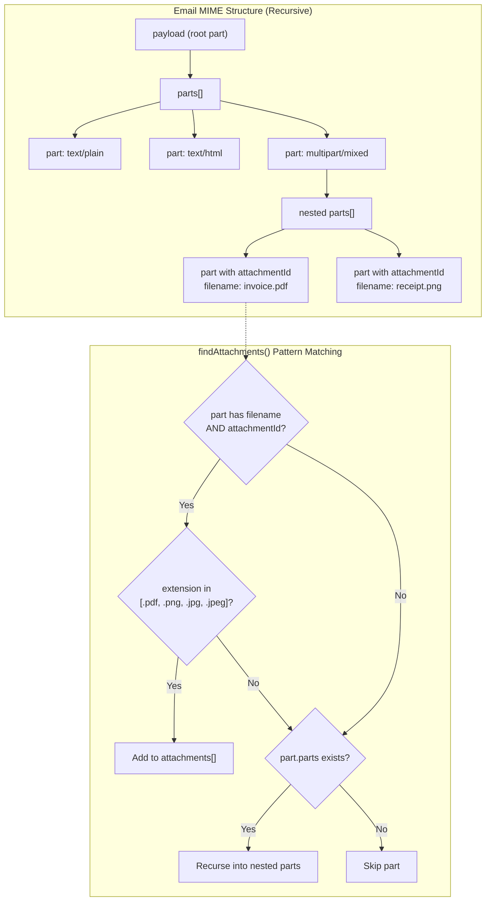
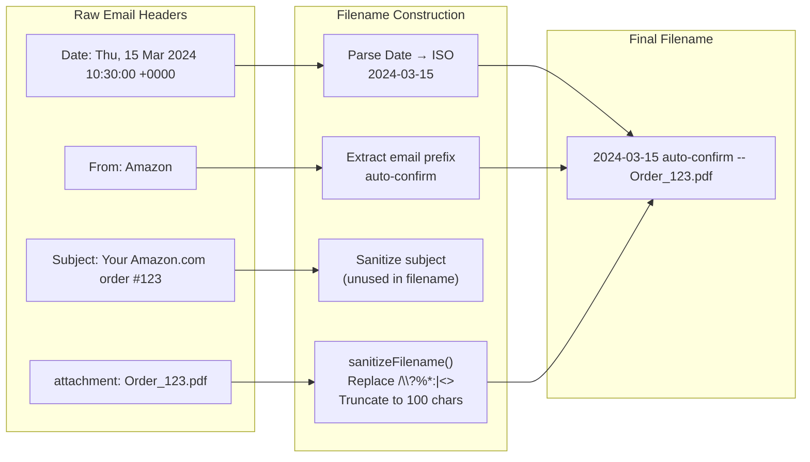
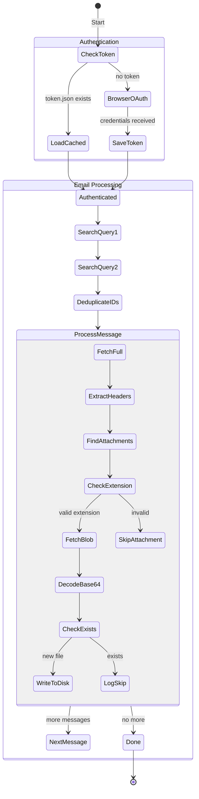

# gmail-invoice-sync architecture overview

snapshot: 2026-01-29T12-09

## what it does

extracts PDF/image attachments from Gmail emails that appear to be invoices, receipts, or order confirmations. downloads them to a local directory with normalized filenames containing date, sender, and original name.

## why it exists

bulk-export financial documentation (invoices, receipts) from Gmail for archival, accounting, or personal record-keeping. designed as a one-time comprehensive extraction tool.

## how it works

1. **authentication**: OAuth2 with Google Cloud credentials, caching tokens for reuse
2. **search**: queries Gmail with two strategies (content-based and sender-based)
3. **extraction**: recursively finds attachments in email parts (handles multipart MIME)
4. **download**: decodes base64 attachments and writes with semantic filenames

---

## main flow

```mermaid
flowchart TB
    subgraph Entry["Entry Point"]
        main["main()"]
    end
    
    subgraph Auth["Authentication Flow"]
        authorize["authorize()"]
        tokenExists{token.json exists?}
        loadToken["Load cached token"]
        browserAuth["Browser OAuth flow"]
        saveToken["Save token to disk"]
    end
    
    subgraph Search["Email Search"]
        queryLoop["For each SEARCH_QUERY"]
        getMessages["getMessages(gmail, query)"]
        paginate["Paginate through all results"]
        dedupe["Deduplicate message IDs with Set"]
    end
    
    subgraph Download["Attachment Processing"]
        processLoop["For each messageId"]
        downloadAttachments["downloadAttachments()"]
        fetchFull["Fetch full message"]
        extractHeaders["Extract date, from, subject headers"]
        findAttachments["findAttachments() - recursive"]
        filterExt{".pdf/.png/.jpg/.jpeg?"}
        fetchBlob["Fetch attachment blob"]
        decodeB64["Decode base64"]
        buildFilename["Build: date sender -- name.ext"]
        existsCheck{File exists?}
        writeFile["Write to disk"]
        skipFile["Skip (already exists)"]
    end
    
    main --> authorize
    authorize --> tokenExists
    tokenExists -->|Yes| loadToken
    tokenExists -->|No| browserAuth
    browserAuth --> saveToken
    loadToken --> queryLoop
    saveToken --> queryLoop
    
    queryLoop --> getMessages
    getMessages --> paginate
    paginate --> dedupe
    dedupe --> processLoop
    
    processLoop --> downloadAttachments
    downloadAttachments --> fetchFull
    fetchFull --> extractHeaders
    extractHeaders --> findAttachments
    findAttachments --> filterExt
    filterExt -->|Yes| fetchBlob
    filterExt -->|No| findAttachments
    fetchBlob --> decodeB64
    decodeB64 --> buildFilename
    buildFilename --> existsCheck
    existsCheck -->|No| writeFile
    existsCheck -->|Yes| skipFile
```



---

## search strategy

two queries OR'd together to maximize coverage:



---

## MIME traversal

emails have nested multipart structure. `findAttachments()` recursively walks the tree:



---

## filename construction



---

## state machine



---

## function reference

| function | purpose | edge cases handled |
|----------|---------|-------------------|
| `authorize()` | OAuth2 authentication with token caching | token reuse, first-run browser flow, credential format (installed vs web) |
| `getMessages()` | paginated Gmail search | empty results, pagination exhaustion |
| `sanitizeFilename()` | clean filenames for filesystem | illegal chars (`/\?%*:\|"<>`), length truncation (100 chars) |
| `downloadAttachments()` | extract and save attachments | missing headers (fallback to "unknown"), nested MIME parts, file deduplication, invalid dates |
| `findAttachments()` | recursive MIME part traversal | deeply nested multipart, non-attachment parts, extension filtering |
| `main()` | orchestration entry point | directory creation, query deduplication, error recovery per-message |

---

## pattern matching cases

### date parsing
- valid RFC 2822 date → ISO format (`2024-03-15`)
- invalid/missing date → `"unknown-date"`

### from header
- `Name <email@domain.com>` → extracts email, takes prefix before `@`
- plain `email@domain.com` → takes prefix before `@`
- missing → `"unknown"`

### attachments
- has `filename` + `attachmentId` + allowed extension → downloaded
- missing any of those → skipped
- nested in multipart → recursively found

### file writing
- file doesn't exist → written
- file exists → skipped (idempotent reruns)

---

## dependencies

- `googleapis` — Gmail API client
- `@google-cloud/local-auth` — OAuth2 browser flow for local apps
- `tsx` — TypeScript execution (dev)

## file structure

```
gmail-invoice-sync/
├── src/
│   └── index.ts          # all logic in single file
├── token.json            # cached OAuth token (gitignored)
├── package.json
└── tsconfig.json
```

## known limitations (as of this snapshot)

- single-file monolith, no separation of concerns
- hardcoded paths (credentials, output dir)
- sequential processing (no concurrency)
- no incremental sync (re-scans entire mailbox each run)
- filename strips domain, making vendor search harder
- browser-based auth incompatible with headless/cloud execution
